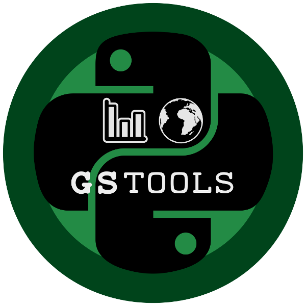
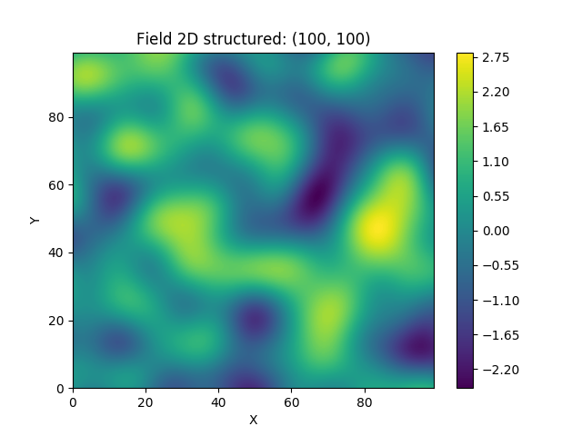
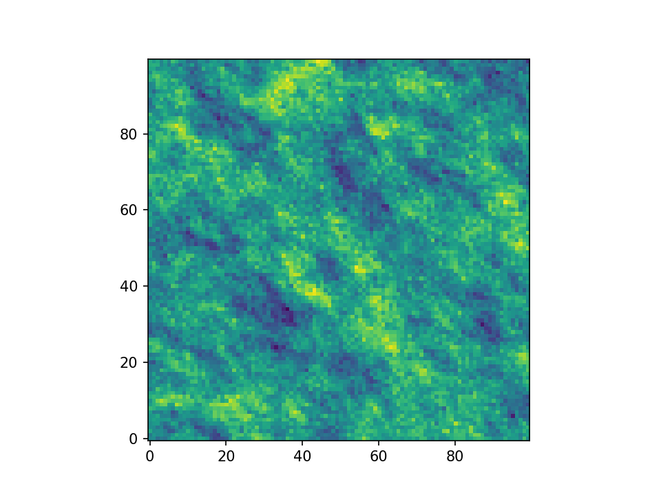

==================
GSTools Quickstart
==================

Purpose
=======

GeoStatTools is a library providing geostatistical tools for random field generation and
variogram estimation based on a list of provided or even user-defined covariance models.

Installation
============

    ``pip install gstools``

Spatial Random Field Generation
===============================

The core of this library is the generation of spatial random fields. These fields are generated using the randomisation method, described by `Heße et al. 2014 <https://doi.org/10.1016/j.envsoft.2014.01.013>`_.

Examples
--------

Gaussian Covariance Model
^^^^^^^^^^^^^^^^^^^^^^^^^

This is an example of how to generate a 2 dimensional spatial random field (:any:`SRF`)
with a :any:`Gaussian` covariance model.

.. code-block:: python

    from gstools import SRF, Gaussian
    import matplotlib.pyplot as pt
    # structured field with a size 100x100 and a grid-size of 1x1
    x = y = range(100)
    model = Gaussian(dim=2, var=1, len_scale=10)
    srf = SRF(model)
    field = srf((x, y), mesh_type='structured')
    pt.imshow(field)
    pt.show()

Truncated Power Law Model
^^^^^^^^^^^^^^^^^^^^^^^^^

GSTools also implements truncated power law variograms, which can be represented as a
superposition of scale dependant modes in form of standard variograms, which are truncated by
a lower- :math:`\ell_{\mathrm{low}}` and an upper length-scale :math:`\ell_{\mathrm{up}}`.

This example shows the truncated power law (:any:`TPLStable`) based on the
:any:`Stable` covariance model and is given by

.. math::
   \gamma_{\ell_{\mathrm{low}},\ell_{\mathrm{up}}}(r) =
   \intop_{\ell_{\mathrm{low}}}^{\ell_{\mathrm{up}}}
   \gamma(r,\lambda) \frac{\rm d \lambda}{\lambda}

with `Stable` modes on each scale:

.. math::
   \gamma(r,\lambda) &=
   \sigma^2(\lambda)\cdot\left(1-
   \exp\left[- \left(\frac{r}{\lambda}\right)^{\alpha}\right]
   \right)\\
   \sigma^2(\lambda) &= C\cdot\lambda^{2H}

which gives Gaussian modes for ``alpha=2`` or Exponential modes for ``alpha=1``.

For :math:`\ell_{\mathrm{low}}=0` this results in:

.. math::
   \gamma_{\ell_{\mathrm{up}}}(r) &=
   \sigma^2_{\ell_{\mathrm{up}}}\cdot\left(1-
   \frac{2H}{\alpha} \cdot
   E_{1+\frac{2H}{\alpha}}
   \left[\left(\frac{r}{\ell_{\mathrm{up}}}\right)^{\alpha}\right]
   \right) \\
   \sigma^2_{\ell_{\ell_{\mathrm{up}}}} &=
   C\cdot\frac{\ell_{\mathrm{up}}^{2H}}{2H}

.. code-block:: python

    import numpy as np
    import matplotlib.pyplot as plt
    from gstools import SRF, TPLStable
    x = y = np.linspace(0, 100, 100)
    model = TPLStable(
        dim=2,           # spatial dimension
        var=1,           # variance (C is calculated internally, so that the variance is actually 1)
        len_low=0,       # lower truncation of the power law
        len_scale=10,    # length scale (a.k.a. range), len_up = len_low + len_scale
        nugget=0.1,      # nugget
        anis=0.5,        # anisotropy between main direction and transversal ones
        angles=np.pi/4,  # rotation angles
        alpha=1.5,       # shape parameter from the stable model
        hurst=0.7,       # hurst coefficient from the power law
    )
    srf = SRF(model, mean=1, mode_no=1000, seed=19970221, verbose=True)
    field = srf((x, y), mesh_type='structured', force_moments=True)
    # show the field in correct xy coordinates
    plt.imshow(field.T, origin="lower")
    plt.show()

Estimating and fitting variograms
=================================

The spatial structure of a field can be analyzed with the variogram, which contains the same information as the covariance function.

All covariance models can be used to fit given variogram data by a simple interface.

Examples
--------

This is an example of how to estimate the variogram of a 2 dimensional unstructured field and estimate the parameters of the covariance
model again.

.. code-block:: python

    import numpy as np
    from gstools import SRF, Exponential, Stable, estimate_unstructured
    from gstools.covmodel.plot import plot_variogram
    import matplotlib.pyplot as plt
    # generate a synthetic field with an exponential model
    x = np.random.RandomState(19970221).rand(1000) * 100.
    y = np.random.RandomState(20011012).rand(1000) * 100.
    model = Exponential(dim=2, var=2, len_scale=8)
    srf = SRF(model, mean=0, seed=19970221)
    field = srf((x, y))
    # estimate the variogram of the field with 40 bins
    bins = np.arange(40)
    bin_center, gamma = estimate_unstructured((x, y), field, bins)
    plt.plot(bin_center, gamma)
    # fit the variogram with a stable model. (no nugget fitted)
    fit_model = Stable(dim=2)
    fit_model.fit_variogram(bin_center, gamma, nugget=False)
    plot_variogram(fit_model, x_max=40)
    # output
    print(fit_model)
    plt.show()

Which gives:

``Stable(dim=2, var=1.92, len_scale=8.15, nugget=0.0, anis=[1.], angles=[0.], alpha=1.05)``

.. image:: pics/exp_vario_fit.png
   :width: 600px
   :align: center

Requirements
============
- `Numpy >= 1.8.2 <http://www.numpy.org>`_
- `SciPy >= 0.19.1 <http://www.scipy.org>`_
- `hankel >= 0.3.6 <https://github.com/steven-murray/hankel>`_
- `emcee <https://github.com/dfm/emcee>`_
- `pyevtk <https://bitbucket.org/pauloh/pyevtk>`_
- `six <https://github.com/benjaminp/six>`_

Content
=======

.. toctree::
   :maxdepth: 4

   package

License
=======

`GPL <https://github.com/LSchueler/GSTools/blob/master/LICENSE>`_ © 2018
