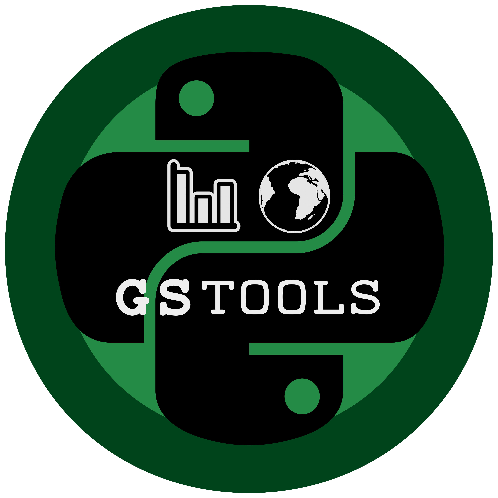

=======================
Welcome to GeoStatTools
=======================

About
-----
GeoStatTools is a library providing geostatistical tools.

Dependencies
------------
- `Numpy <http://www.numpy.org>`_
- `SciPy <http://www.scipy.org>`_

Installation
------------
    ``pip install gstools``

Generation example
------------------
This is an example of how to generate a 2 dimensional spatial random field with a Gaussian covariance structure.

.. code-block:: python

   import numpy as np
   from gstools.field import SRF

   x = np.linspace(0, 10, 120)
   y = np.linspace(-5, 5, 100)

   cov_model = {'dim': 2, 'var': 1.6, 'len_scale': 4.5, 'model': 'gau', 'mode_no': 1000}

   srf = SRF(**cov_model)
   field = srf(x, y, seed=19970221, mesh_type='structured')

Variogram example
-----------------
The spatial structure of a field can be analyzed with the variogram, which contains the same information as the covariance function.

This is an example of how to estimate the variogram of a 2 dimensional unstructured field.

.. code-block:: python

   import numpy as np
   from gstools.field import SRF
   from gstools import variogram

   #random samples between 0 <= x, y < 100
   x = np.random.rand(1000) * 100.
   y = np.random.rand(1000) * 100.

   srf = SRF(dim=2, var=2, len_scale=30)
   field = srf(x, y, seed=20011012)

   bins = np.arange(0, 50)

   gamma = variogram.estimate_unstructured(field, bins, x, y)

Modules
-------
.. toctree::
   :maxdepth: 2

   main
