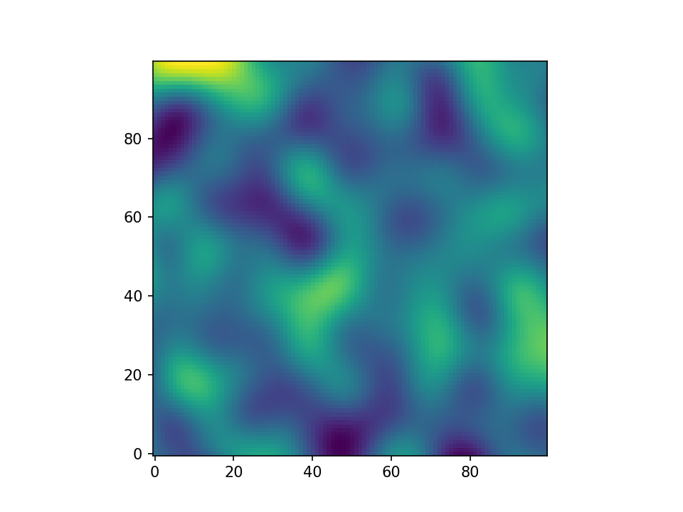
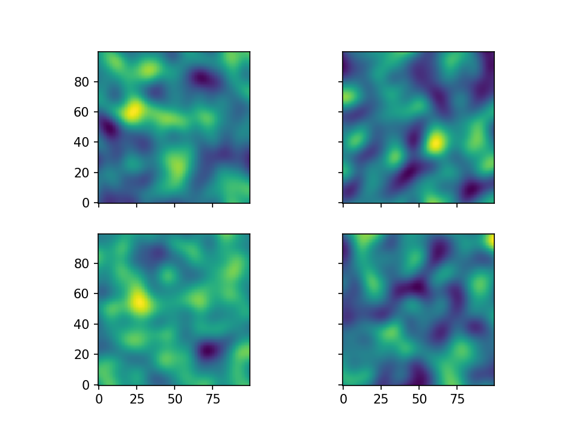
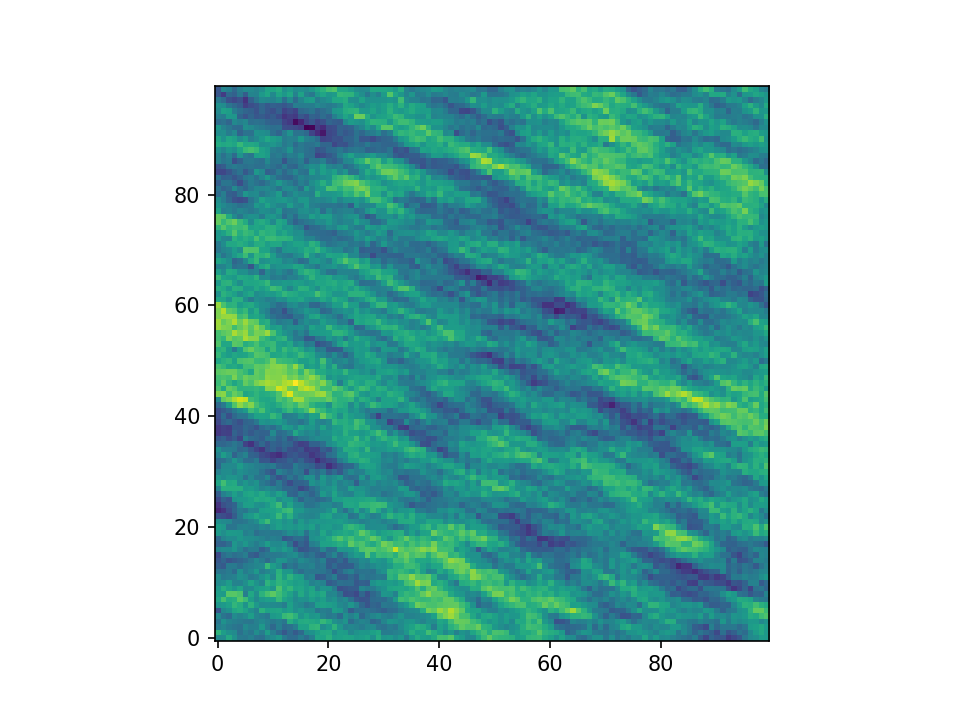
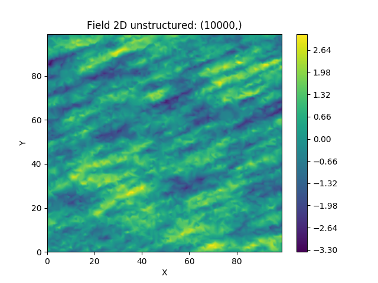
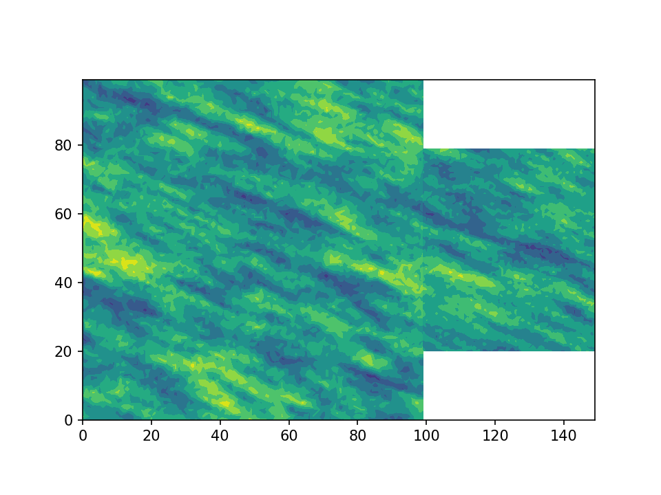

Tutorial 1: Random Field Generation
===================================

The main feature of GSTools is the spatial random field generator :any:`SRF`,
which can generate random fields following a given covariance model.
The generator provides a lot of nice features, which will be explained in
the following

Theoretical Background
----------------------

GSTools generates spatial random fields with a given covariance model or
semi-variogram. This is done by using the so-called randomization method.
The spatial random field is represented by a stochastic Fourier integral
and its discretised modes are evaluated at random frequencies.

GSTools supports arbitrary and non-isotropic covariance models.

A very Simple Example
---------------------

We are going to start with a very simple example of a spatial random field
with an isotropic Gaussian covariance model and following parameters:

- variance :math:`\sigma^2=1`
- correlation length :math:`\lambda=10`

First, we set things up and create the axes for the field. We are going to
need the :any:`SRF` class for the actual generation of the spatial random field.
But :any:`SRF` also needs a covariance model and we will simply take the :any:`Gaussian` model.

.. code-block:: python

    from gstools import SRF, Gaussian

    x = y = range(100)

Now we create the covariance model with the parameters :math:`\sigma^2` and
:math:`\lambda` and hand it over to :any:`SRF`. By specifying a seed,
we make sure to create reproducible results:

.. code-block:: python

    model = Gaussian(dim=2, var=1, len_scale=10)
    srf = SRF(model, seed=20170519)

With these simple steps, everything is ready to create our first random field.
We will create the field on a structured grid (as you might have guessed from the `x` and `y`), which makes it easier to plot.

.. code-block:: python

    field = srf.structured([x, y])
    srf.plot()

Yielding

Wow, that was pretty easy!

The script can be found in :download:`gstools/examples/00_gaussian.py<../../examples/00_gaussian.py>`

Creating an Ensemble of Fields
------------------------------

Creating an ensemble of random fields would also be
a great idea. Let's reuse most of the previous code.

.. code-block:: python

    import numpy as np
    import matplotlib.pyplot as pt
    from gstools import SRF, Gaussian

    x = y = np.arange(100)

    model = Gaussian(dim=2, var=1, len_scale=10)
    srf = SRF(model)

This time, we did not provide a seed to :any:`SRF`, as the seeds will used
during the actual computation of the fields. We will create four ensemble
members, for better visualisation and save them in a list and in a first
step, we will be using the loop counter as the seeds.

.. code-block:: python

    ens_no = 4
    field = []
    for i in range(ens_no):
        field.append(srf.structured([x, y], seed=i))

Now let's have a look at the results:

.. code-block:: python

    fig, ax = pt.subplots(2, 2, sharex=True, sharey=True)
    ax = ax.flatten()
    for i in range(ens_no):
        ax[i].imshow(field[i].T, origin='lower')
    pt.show()

Yielding

The script can be found in :download:`gstools/examples/05_srf_ensemble.py<../../examples/05_srf_ensemble.py>`

Using better Seeds
^^^^^^^^^^^^^^^^^^

It is not always a good idea to use incrementing seeds. Therefore GSTools
provides a seed generator :any:`MasterRNG`. The loop, in which the fields are generated would
then look like

.. code-block:: python

    from gstools.random import MasterRNG
    seed = MasterRNG(20170519)
    for i in range(ens_no):
        field.append(srf.structured([x, y], seed=seed()))

Creating Fancier Fields
-----------------------

Only using Gaussian covariance fields gets boring. Now we are going to create much rougher random fields by using an exponential covariance model and we are going to make them anisotropic.

The code is very similar to the previous examples, but with a different covariance model class :any:`Exponential`. As model parameters we a using following

- variance :math:`\sigma^2=1`
- correlation length :math:`\lambda=(12, 3)^T`
- rotation angle :math:`\theta=\pi/8`

.. code-block:: python

    import numpy as np
    from gstools import SRF, Exponential

    x = y = np.arange(100)

    model = Exponential(dim=2, var=1, len_scale=[12., 3.], angles=np.pi/8.)
    srf = SRF(model, seed=20170519)

    srf.structured([x, y])
    srf.plot()

Yielding

The anisotropy ratio could also have been set with

.. code-block:: python

    model = Exponential(dim=2, var=1, len_scale=12., anis=3./12., angles=np.pi/8.)

Using an Unstructured Grid
--------------------------

For many applications, the random fields are needed on an unstructured grid.
Normally, such a grid would be read in, but we can simply generate one and
then create a random field at those coordinates.

.. code-block:: python

    import numpy as np
    from gstools import SRF, Exponential
    from gstools.random import MasterRNG

    seed = MasterRNG(19970221)
    rng = np.random.RandomState(seed())
    x = rng.randint(0, 100, size=10000)
    y = rng.randint(0, 100, size=10000)

    model = Exponential(dim=2, var=1, len_scale=[12., 3.], angles=np.pi/8.)

    srf = SRF(model, seed=20170519)
    srf([x, y])
    srf.plot()

Yielding

Comparing this image to the previous one, you can see that be using the same
seed, the same field can be computed on different grids.

The script can be found in :download:`gstools/examples/06_unstr_srf_export.py<../../examples/06_unstr_srf_export.py>`

Exporting a Field
-----------------

Using the field from `previous example <Using an Unstructured Grid_>`__, it can simply be exported to the file
``field.vtu`` and viewed by e.g. paraview with following lines of code

.. code-block:: python

    srf.vtk_export("field")

Or it could visualized immediately in Python using `PyVista <https://docs.pyvista.org>`__:

.. code-block:: python

    mesh = srf.to_pyvista("field")
    mesh.plot()

The script can be found in :download:`gstools/examples/04_export.py<../../examples/04_export.py>` and
in :download:`gstools/examples/06_unstr_srf_export.py<../../examples/06_unstr_srf_export.py>`

Merging two Fields
------------------

We can even generate the same field realisation on different grids. Let's try
to merge two unstructured rectangular fields. The first field will be generated
exactly like in example `Using an Unstructured Grid`_:

.. code-block:: python

    import numpy as np
    import matplotlib.pyplot as pt
    from gstools import SRF, Exponential
    from gstools.random import MasterRNG

    seed = MasterRNG(19970221)
    rng = np.random.RandomState(seed())
    x = rng.randint(0, 100, size=10000)
    y = rng.randint(0, 100, size=10000)

    model = Exponential(dim=2, var=1, len_scale=[12., 3.], angles=np.pi/8.)

    srf = SRF(model, seed=20170519)

    field = srf([x, y])

But now we extend the field on the right hand side by creating a new
unstructured grid and calculating a field with the same parameters and the
same seed on it:

.. code-block:: python

    # new grid
    seed = MasterRNG(20011012)
    rng = np.random.RandomState(seed())
    x2 = rng.randint(99, 150, size=10000)
    y2 = rng.randint(20, 80, size=10000)

    field2 = srf((x2, y2))

    pt.tricontourf(x, y, field.T)
    pt.tricontourf(x2, y2, field2.T)
    pt.axes().set_aspect('equal')
    pt.show()

Yielding

The slight mismatch where the two fields were merged is merely due to
interpolation problems of the plotting routine. You can convince yourself
be increasing the resolution of the grids by a factor of 10.

Of course, this merging could also have been done by appending the grid
point ``(x2, y2)`` to the original grid ``(x, y)`` before generating the field.
But one application scenario would be to generate hugh fields, which would not
fit into memory anymore.

The script can be found in :download:`gstools/examples/07_srf_merge.py<../../examples/07_srf_merge.py>`

.. raw:: latex

    \clearpage
