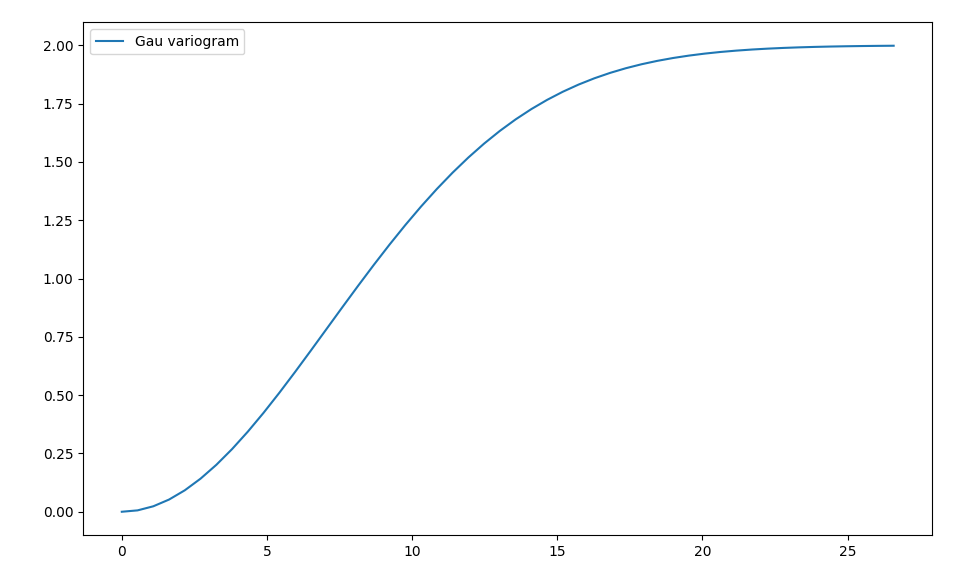
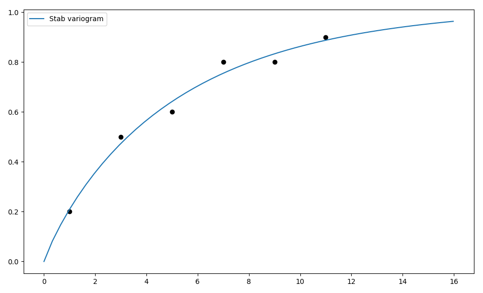

Tutorial 2: The Covariance Model
================================

One of the core-features of GSTools is the powerful :any:`CovModel`
class, which allows you to easily define arbitrary covariance models by
yourself. The resulting models provide a bunch of nice features to explore the
covariance models.

Theoretical Backgound
---------------------

A covariance model is used to characterize the
`semi-variogram <https://en.wikipedia.org/wiki/Variogram#Semivariogram>`_,
denoted by :math:`\gamma`, of a spatial random field.
In GSTools, we use the following form for an isotropic and stationary field:

.. math::
   \gamma\left(r\right)=
   \sigma^2\cdot\left(1-\mathrm{cor}\left(r\right)\right)+n

Where:
  - :math:`\mathrm{cor}(r)` is the so called
    `correlation <https://en.wikipedia.org/wiki/Autocovariance#Normalization>`_
    function depending on the distance :math:`r`
  - :math:`\sigma^2` is the variance
  - :math:`n` is the nugget (subscale variance)

.. note::

   We are not limited to isotropic models. We support anisotropy ratios for
   length scales in orthogonal transversal directions like:

   - :math:`x` (main direction)
   - :math:`y` (1. transversal direction)
   - :math:`z` (2. transversal direction)

   These main directions can also be rotated, but we will come to that later.

Example
-------

Let us start with a short example of a self defined model (Of course, we
provide a lot of predefined models [See: :any:`gstools.covmodel`],
but they all work the same way).
Therefore we reimplement the Gaussian covariance model by defining just the
`correlation <https://en.wikipedia.org/wiki/Autocovariance#Normalization>`_ function:

.. code-block:: python

    from gstools import CovModel
    import numpy as np
    # use CovModel as the base-class
    class Gau(CovModel):
        def correlation(self, r):
            return np.exp(-(r/self.len_scale)**2)

Now we can instantiate this model:

.. code-block:: python

    model = Gau(dim=2, var=2., len_scale=10)

To have a look at the variogram, let's plot it:

.. code-block:: python

    from gstools.covmodel.plot import plot_variogram
    plot_variogram(model)

Which gives:

Parameters
----------

We already used some parameters, which every covariance models has. The basic ones
are:

    - **dim** : dimension of the model
    - **var** : variance of the model (on top of the subscale variance)
    - **len_scale** : length scale of the model
    - **nugget** : nugget (subscale variance) of the model

These are the common parameters used to characterize a covariance model and are
therefore used by every model in GSTools. You can also access and reset them:

.. code-block:: python

    print(model.dim, model.var, model.len_scale, model.nugget, model.sill)
    model.dim = 3
    model.var = 1
    model.len_scale = 15
    model.nugget = 0.1
    print(model.dim, model.var, model.len_scale, model.nugget, model.sill)

Which gives:

.. code-block:: python

    2 2.0 10 0.0 2.0
    3 1.0 15 0.1 1.1

.. note::

   - The sill of the variogram is calculated by ``sill = variance + nugget``
     So we treat the variance as everything **above** the nugget, which is sometimes
     called **partial sill**.
   - A covariance model can also have additional parameters.

Anisotropy
----------

The internally used (semi-) variogram represents the isotropic case for the model.
Nevertheless, you can provide anisotropy ratios by:

.. code-block:: python

    model = Gau(dim=3, var=2., len_scale=10, anis=0.5)
    print(model.anis)
    print(model.len_scale_vec)

Which gives:

.. code-block:: python

    [0.5 1. ]
    [10.  5. 10.]

As you can see, we defined just one anisotropy-ratio and the second transversal
direction was filled up with ``1.`` and you can get the length-scales in each
direction by the attribute :any:`len_scale_vec`. For full control you can set
a list of anistropy ratios: ``anis=[0.5, 0.4]``.

Alternatively you can provide a list of length-scales:

.. code-block:: python

    model = Gau(dim=3, var=2., len_scale=[10, 5, 4])
    print(model.anis)
    print(model.len_scale)
    print(model.len_scale_vec)

Which gives:

.. code-block:: python

    [0.5 0.4]
    10
    [10.  5.  4.]

Rotation Angles
---------------

The main directions of the field don't have to coincide with the spatial
directions :math:`x`, :math:`y` and :math:`z`. Therefore you can provide
rotation angles for the model:

.. code-block:: python

    model = Gau(dim=3, var=2., len_scale=10, angles=2.5)
    print(model.angles)

Which gives:

.. code-block:: python

    [2.5 0.  0. ]

Again, the angles were filled up with ``0.`` to match the dimension and you
could also provide a list of angles. The number of angles depends on the
given dimension:

- in 1D: no rotation performable
- in 2D: given as rotation around z-axis
- in 3D: given by yaw, pitch, and roll (known as
  `Tait–Bryan <https://en.wikipedia.org/wiki/Euler_angles#Tait-Bryan_angles>`_
  angles)

Methods
-------

The covariance model class :any:`CovModel` of GSTools provides a set of handy
methods.

Basics
^^^^^^

One of the following functions defines the main characterization of the
variogram:

- ``variogram`` : The variogram of the model given by

  .. math::
     \gamma\left(r\right)=
     \sigma^2\cdot\left(1-\mathrm{cor}\left(r\right)\right)+n

- ``covariance`` : The (auto-)covariance of the model given by

  .. math::
     C\left(r\right)= \sigma^2\cdot\mathrm{cor}\left(r\right)

- ``correlation`` : The (auto-)correlation (or normalized covariance)
  of the model given by

  .. math::
     \mathrm{cor}\left(r\right)

As you can see, it is the easiest way to define a covariance model by giving a
correlation function as demonstrated by the above model ``Gau``.
If one of the above functions is given, the others will be determined:

.. code-block:: python

    model = Gau(dim=3, var=2., len_scale=10, nugget=0.5)
    print(model.variogram(10.))
    print(model.covariance(10.))
    print(model.correlation(10.))

Which gives:

.. code-block:: python

    1.7642411176571153
    0.6321205588285577
    0.7357588823428847
    0.36787944117144233

Spectral methods
^^^^^^^^^^^^^^^^

The spectrum of a covariance model is given by:

.. math:: S(\mathbf{k}) = \left(\frac{1}{2\pi}\right)^n
   \int C(\Vert\mathbf{r}\Vert) e^{i b\mathbf{k}\cdot\mathbf{r}} d^n\mathbf{r}

Since the covariance function :math:`C(r)` is radially symmetric, we can
calculate this by the
`hankel-transformation <https://en.wikipedia.org/wiki/Hankel_transform>`_:

.. math:: S(k) = \left(\frac{1}{2\pi}\right)^n \cdot
   \frac{(2\pi)^{n/2}}{(bk)^{n/2-1}}
   \int_0^\infty r^{n/2-1} C(r) J_{n/2-1}(bkr) r dr

Where :math:`k=\left\Vert\mathbf{k}\right\Vert`.

Depending on the spectrum, the spectral-density is defined by:

.. math:: \tilde{S}(k) = \frac{S(k)}{\sigma^2}

You can access these methods by:

.. code-block:: python

    model = Gau(dim=3, var=2., len_scale=10)
    print(model.spectrum(0.1))
    print(model.spectral_density(0.1))

Which gives:

.. code-block:: python

    34.96564773852395
    17.482823869261974

.. note::
   The spectral-density is given by the radius of the input phase. But it is
   **not** a probability density function for the radius of the phase.
   To obtain the pdf for the phase-radius, you can use the methods
   :any:`spectral_rad_pdf` or :any:`ln_spectral_rad_pdf` for the logarithm.

   The user can also provide a cdf (cumulative distribution function) by
   defining a method called ``spectral_rad_cdf`` and/or a ppf (percent-point function)
   by ``spectral_rad_ppf``.

   The attributes :any:`has_cdf` and :any:`has_ppf` will check for that.

Different scales
----------------

Besides the length-scale, there are many other ways of characterizing a certain
scale of a covariance model. We provide two common scales with the covariance
model.

Integral scale
^^^^^^^^^^^^^^

The `integral scale <https://en.wikipedia.org/wiki/Integral_length_scale>`_
of a covariance model is calculated by:

.. math:: I = \int_0^\infty \mathrm{cor}(r) dr

You can access it by:

.. code-block:: python

    model = Gau(dim=3, var=2., len_scale=10)
    print(model.integral_scale)
    print(model.integral_scale_vec)

Which gives:

.. code-block:: python

    8.862269254527579
    [8.86226925 8.86226925 8.86226925]

You can also specify integral length scales like the ordinary length scale,
and len_scale/anis will be recalculated:

.. code-block:: python

    model = Gau(dim=3, var=2., integral_scale=[10, 4, 2])
    print(model.anis)
    print(model.len_scale)
    print(model.len_scale_vec)
    print(model.integral_scale)
    print(model.integral_scale_vec)

Which gives:

.. code-block:: python

    [0.4 0.2]
    11.283791670955127
    [11.28379167  4.51351667  2.25675833]
    10.000000000000002
    [10.  4.  2.]

Percentile scale
^^^^^^^^^^^^^^^^

Another scale characterizing the covariance model, is the percentile scale.
It is the distance, where the normalized variogram reaches a certain percentage
of its sill.

.. code-block:: python

    model = Gau(dim=3, var=2., len_scale=10)
    print(model.percentile_scale(0.9))

Which gives:

.. code-block:: python

    15.174271293851463

.. note::

   The nugget is neglected by this percentile_scale.

Additional Parameters
---------------------

Let's pimp our self-defined model ``Gau`` by setting the exponent as an additional
parameter:

.. math:: \mathrm{cor}(r) := \exp\left(-\left(\frac{r}{\ell}\right)^{\alpha}\right)

This leads to the so called **stable** covariance model and we can define it by

.. code-block:: python

    class Stab(CovModel):
        def default_opt_arg(self):
            return {"alpha": 1.5}
        def correlation(self, r):
            return np.exp(-(r/self.len_scale)**self.alpha)

As you can see, we override the method :any:`CovModel.default_opt_arg` to provide
a standard value for the optional argument ``alpha`` and we can access it
in the correlation function by ``self.alpha``

Now we can instantiate this model:

.. code-block:: python

    model1 = Stab(dim=2, var=2., len_scale=10)
    model2 = Stab(dim=2, var=2., len_scale=10, alpha=0.5)
    print(model1)
    print(model2)

Which gives:

.. code-block:: python

    Stab(dim=2, var=2.0, len_scale=10, nugget=0.0, anis=[1.], angles=[0.], alpha=1.5)
    Stab(dim=2, var=2.0, len_scale=10, nugget=0.0, anis=[1.], angles=[0.], alpha=0.5)

.. note::

   You don't have to overrid the :any:`CovModel.default_opt_arg`, but you will
   get a ValueError if you don't set it on creation.

Fitting variogram data
----------------------

The model class comes with a routine to fit the model-parameters to given
variogram data. Have a look at the following:

.. code-block:: python

    # data
    x = [1.0, 3.0, 5.0, 7.0, 9.0, 11.0]
    y = [0.2, 0.5, 0.6, 0.8, 0.8, 0.9]
    # fitting model
    model = Stab(dim=2)
    # we have to provide boundaries for the parameters
    model.set_arg_bounds(alpha=[0, 3])
    # fit the model to given data, deselect nugget
    results, pcov = model.fit_variogram(x, y, nugget=False)
    print(results)
    # show the fitting
    from matplotlib import pyplot as plt
    from gstools.covmodel.plot import plot_variogram
    plt.scatter(x, y, color="k")
    plot_variogram(model)
    plt.show()

Which gives:

.. code-block:: python

    {'var': 1.024575782651677,
     'len_scale': 5.081620691462197,
     'nugget': 0.0,
     'alpha': 0.906705123369987}

As you can see, we have to provide boundaries for the parameters.
As a default, the following bounds are set:

- additional parameters: ``[-np.inf, np.inf]``
- variance: ``[0.0, np.inf]``
- len_scale: ``[0.0, np.inf]``
- nugget: ``[0.0, np.inf]``

Also, you can deselect parameters from fitting, so their predefined values
will be kept. In our case, we fixed a ``nugget`` of ``0.0``, which was set
by default. You can deselect any standard or optional argument of the covariance model.
The second return value ``pcov`` is the estimated covariance of ``popt`` from
the used scipy routine :any:`scipy.optimize.curve_fit`.

You can use the following methods to manipulate the used bounds:

.. currentmodule:: gstools.covmodel.base

.. autosummary::
   CovModel.default_opt_arg_bounds
   CovModel.default_arg_bounds
   CovModel.set_arg_bounds
   CovModel.check_arg_bounds

You can override the :any:`CovModel.default_opt_arg_bounds` to provide standard
bounds for your additional parameters.

To access the bounds you can use:

.. autosummary::
   CovModel.var_bounds
   CovModel.len_scale_bounds
   CovModel.nugget_bounds
   CovModel.opt_arg_bounds
   CovModel.arg_bounds

Provided Covariance Models
--------------------------

The following standard covariance models are provided by GSTools

.. currentmodule:: gstools.covmodel.models

.. autosummary::
   Gaussian
   Exponential
   Matern
   Stable
   Rational
   Linear
   Circular
   Spherical
   Intersection

As a special feature, we also provide truncated power law (TPL) covariance models

.. currentmodule:: gstools.covmodel.tpl_models

.. autosummary::
   TPLGaussian
   TPLExponential
   TPLStable

.. raw:: latex

    \clearpage
