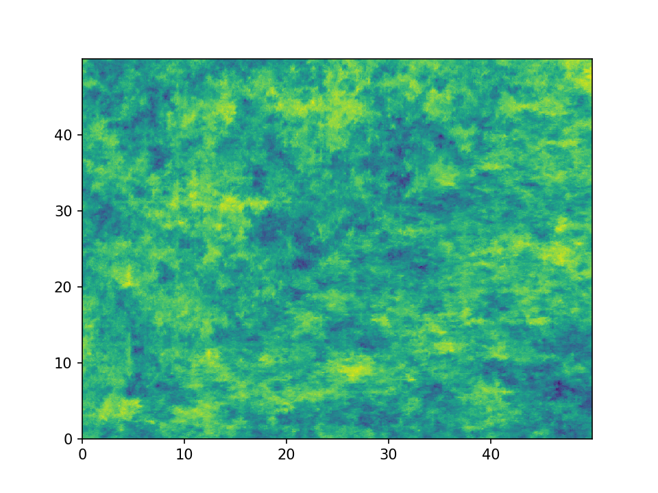
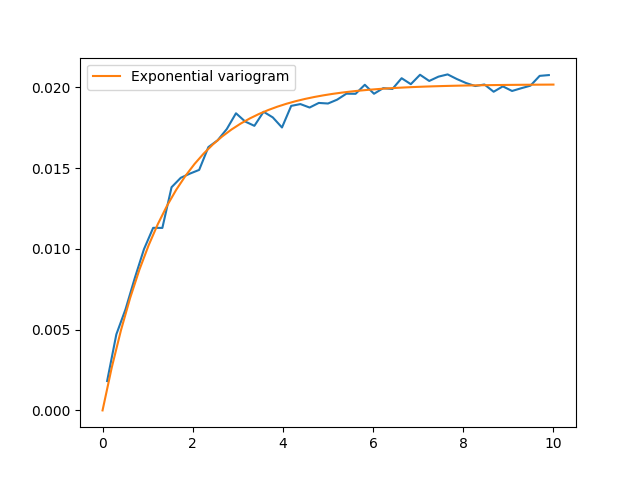
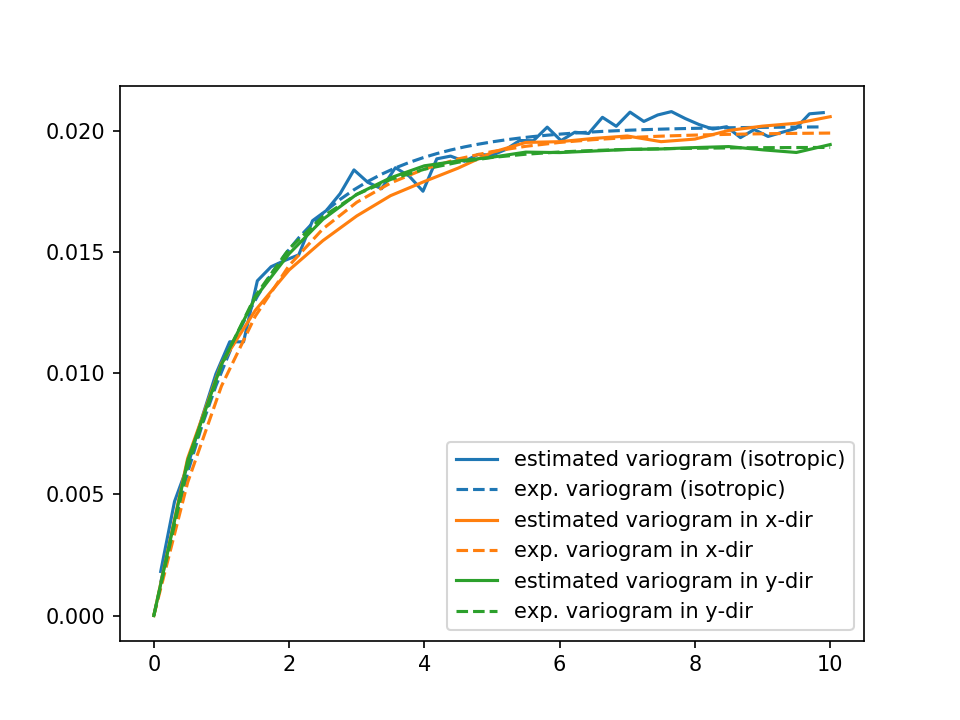
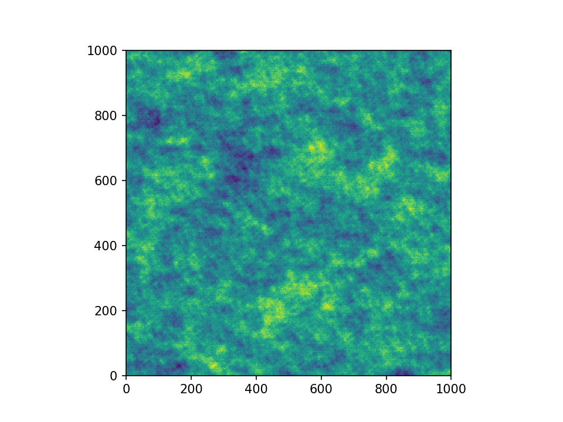

Tutorial 3: Variogram Estimation
================================

Estimating the spatial correlations is an important part of geostatistics.
These spatial correlations can be expressed by the variogram, which can be
estimated with the subpackage :any:`gstools.variogram`. The variograms can be
estimated on structured and unstructured grids.

Theoretical Background
----------------------

The same `(semi-)variogram <https://en.wikipedia.org/wiki/Variogram#Semivariogram>`_ as
:doc:`the Covariance Model</tutorial_02_cov>` is being used
by this subpackage.

An Example with Actual Data
---------------------------

This example is going to be a bit more extensive and we are going to do some
basic data preprocessing for the actual variogram estimation. But this example
will be self-contained and all data gathering and processing will be done in
this example script.

The complete script can be found in :download:`gstools/examples/08_variogram_estimation.py<../../examples/08_variogram_estimation.py>`

*This example will only work with Python 3.*

The Data
^^^^^^^^

We are going to analyse the Herten aquifer, which is situated in Southern
Germany. Multiple outcrop faces where surveyed and interpolated to a 3D
dataset. In these publications, you can find more information about the data:

| Bayer, Peter; Comunian, Alessandro; Höyng, Dominik; Mariethoz, Gregoire (2015): Physicochemical properties and 3D geostatistical simulations of the Herten and the Descalvado aquifer analogs. PANGAEA, https://doi.org/10.1594/PANGAEA.844167,
| Supplement to: Bayer, P et al. (2015): Three-dimensional multi-facies realizations of sedimentary reservoir and aquifer analogs. Scientific Data, 2, 150033, https://doi.org/10.1038/sdata.2015.33
|

Retrieving the Data
^^^^^^^^^^^^^^^^^^^

To begin with, we need to download and extract the data. Therefore, we are
going to use some built-in Python libraries. For simplicity, many values and
strings will be hardcoded.

.. code-block:: python

    import os
    import urllib.request
    import zipfile
    import numpy as np
    import matplotlib.pyplot as pt

    def download_herten():
        # download the data, warning: its about 250MB
        print('Downloading Herten data')
        data_filename = 'data.zip'
        data_url = 'http://store.pangaea.de/Publications/Bayer_et_al_2015/Herten-analog.zip'
        urllib.request.urlretrieve(data_url, 'data.zip')

        # extract the data
        with zipfile.ZipFile(data_filename, 'r') as zf:
            zf.extract(os.path.join('Herten-analog', 'sim-big_1000x1000x140',
                                    'sim.vtk'))

That was that. But we also need a script to convert the data into a format we
can use. This script is also kindly provided by the authors. We can download
this script in a very similar manner as the data:

.. code-block:: python

    def download_scripts():
        # download a script for file conversion
        print('Downloading scripts')
        tools_filename = 'scripts.zip'
        tool_url = 'http://store.pangaea.de/Publications/Bayer_et_al_2015/tools.zip'
        urllib.request.urlretrieve(tool_url, tools_filename)

        # only extract the script we need
        with zipfile.ZipFile(tools_filename, 'r') as zf:
            zf.extract(os.path.join('tools', 'vtk2gslib.py'))

These two functions can now be called:

.. code-block:: python

    download_herten()
    download_scripts()

Preprocessing the Data
^^^^^^^^^^^^^^^^^^^^^^

First of all, we have to convert the data with the script we just downloaded

.. code-block:: python

    # import the downloaded conversion script
    from tools.vtk2gslib import vtk2numpy

    # load the Herten aquifer with the downloaded vtk2numpy routine
    print('Loading data')
    herten, grid = vtk2numpy(os.path.join('Herten-analog', 'sim-big_1000x1000x140', 'sim.vtk'))

The data only contains facies, but from the supplementary data, we know the
hydraulic conductivity values of each facies, which we will simply paste here
and assign them to the correct facies

.. code-block:: python

    # conductivity values per fazies from the supplementary data
    cond = np.array([2.50E-04, 2.30E-04, 6.10E-05, 2.60E-02, 1.30E-01,
                     9.50E-02, 4.30E-05, 6.00E-07, 2.30E-03, 1.40E-04,])

    # asign the conductivities to the facies
    herten_cond = cond[herten]

Next, we are going to calculate the transmissivity, by integrating over the
vertical axis

.. code-block:: python

    # integrate over the vertical axis, calculate transmissivity
    herten_log_trans = np.log(np.sum(herten_cond, axis=2) * grid['dz'])

The Herten data provides information about the grid, which was already used in
the previous code block. From this information, we can create our own grid on
which we can estimate the variogram. As a first step, we are going to estimate
an isotropic variogram, meaning that we will take point pairs from all
directions into account. An unstructured grid is a natural choice for this.
Therefore, we are going to create an unstructured grid from the given,
structured one. For this, we are going to write another small function

.. code-block:: python

    def create_unstructured_grid(x_s, y_s):
        x_u, y_u = np.meshgrid(x_s, y_s)
        len_unstruct = len(x_s) * len(y_s)
        x_u = np.reshape(x_u, len_unstruct)
        y_u = np.reshape(y_u, len_unstruct)
        return x_u, y_u

    # create a structured grid on which the data is defined
    x_s = np.arange(grid['ox'], grid['nx']*grid['dx'], grid['dx'])
    y_s = np.arange(grid['oy'], grid['ny']*grid['dy'], grid['dy'])

    # create an unstructured grid for the variogram estimation
    x_u, y_u = create_unstructured_grid(x_s, y_s)

Let's have a look at the transmissivity field of the Herten aquifer

.. code-block:: python

    pt.imshow(herten_log_trans.T, origin='lower', aspect='equal')
    pt.show()

Estimating the Variogram
^^^^^^^^^^^^^^^^^^^^^^^^

Finally, everything is ready for the variogram estimation. For the unstructured
method, we have to define the bins on which the variogram will be estimated.
Through expert knowledge (i.e. fiddling around), we assume that the main
features of the variogram will be below 10 metres distance. And because the
data has a high spatial resolution, the resolution of the bins can also be
high. The transmissivity data is still defined on a structured grid, but we can
simply flatten it with :any:`numpy.ndarray.flatten`, in order to bring it into
the right shape. It might be more memory efficient to use
``herten_log_trans.reshape(-1)``, but for better readability, we will stick to
:any:`numpy.ndarray.flatten`. Taking all data points into account would take a
very long time (expert knowledge \*wink\*), thus we will only take 2000 datapoints into account, which are sampled randomly. In order to make the exact
results reproducible, we can also set a seed.

.. code-block:: python

    from gstools import vario_estimate_unstructured

    bins = np.linspace(0, 10, 50)
    print('Estimating unstructured variogram')
    bin_center, gamma = vario_estimate_unstructured(
        (x_u, y_u),
        herten_log_trans.flatten(),
        bins,
        sampling_size=2000,
        sampling_seed=19920516,
        )

The estimated variogram is calculated on the centre of the given bins,
therefore, the ``bin_center`` array is also returned.

Fitting the Variogram
^^^^^^^^^^^^^^^^^^^^^

Now, we can see, if the estimated variogram can be modelled by a common
variogram model. Let's try the :any:`Exponential` model.

.. code-block:: python

    from gstools import Exponential

    # fit an exponential model
    fit_model = Exponential(dim=2)
    fit_model.fit_variogram(bin_center, gamma, nugget=False)

Finally, we can visualise some results. For quickly plotting a covariance
model, GSTools provides some helper functions.

.. code-block:: python

    from gstools.covmodel.plot import plot_variogram
    pt.plot(bin_center, gamma)
    plot_variogram(fit_model, x_max=bins[-1])
    pt.show()

That looks like a pretty good fit! By printing the model, we can directly see
the fitted parameters

.. code-block:: python

    print(fit_model)

which gives

.. code-block:: python

    Exponential(dim=2, var=0.020193095802479327, len_scale=1.4480057557321007, nugget=0.0, anis=[1.], angles=[0.])

With this data, we could start generating new ensembles of the Herten aquifer
with the :any:`SRF` class.

Estimating the Variogram in Specific Directions
^^^^^^^^^^^^^^^^^^^^^^^^^^^^^^^^^^^^^^^^^^^^^^^

Estimating a variogram on a structured grid gives us the possibility to only
consider values in a specific direction. This could be a first test, to see if
the data is anisotropic.
In order to speed up the calculations, we are going to only use every 10th datapoint and for a comparison with the isotropic variogram calculated earlier, we
only need the first 21 array items.

.. code-block:: python

    x_s = x_s[::10][:21]
    y_s = y_s[::10][:21]
    herten_trans_log = herten_log_trans[::10,::10]

With this much smaller data set, we can immediately estimate the variogram in
the x- and y-axis

.. code-block:: python

    from gstools import vario_estimate_structured
    print('Estimating structured variograms')
    gamma_x = vario_estimate_structured(herten_trans_log, direction='x')[:21]
    gamma_y = vario_estimate_structured(herten_trans_log, direction='y')[:21]

With these two estimated variograms, we can start fitting :any:`Exponential`
covariance models

.. code-block:: python

    fit_model_x = Exponential(dim=2)
    fit_model_x.fit_variogram(x_s, gamma_x, nugget=False)
    fit_model_y = Exponential(dim=2)
    fit_model_y.fit_variogram(y_s, gamma_y, nugget=False)

Now, the isotropic variogram and the two variograms in x- and y-direction can
be plotted together with their respective models, which will be plotted with
dashed lines.

.. code-block:: python

    line, = pt.plot(bin_center, gamma, label='estimated variogram (isotropic)')
    pt.plot(bin_center, fit_model.variogram(bin_center), color=line.get_color(),
            linestyle='--', label='exp. variogram (isotropic)')

    line, = pt.plot(x_s, gamma_x, label='estimated variogram in x-dir')
    pt.plot(x_s, fit_model_x.variogram(x_s), color=line.get_color(),
            linestyle='--', label='exp. variogram in x-dir')

    line, = pt.plot(y_s, gamma_y, label='estimated variogram in y-dir')
    pt.plot(y_s, fit_model_y.variogram(y_s),
        color=line.get_color(), linestyle='--', label='exp. variogram in y-dir')

    pt.legend()
    pt.show()

Giving

The plot might be a bit cluttered, but at least it is pretty obvious that the
Herten aquifer has no apparent anisotropies in its spatial structure.

Creating a Spatial Random Field from the Herten Parameters
^^^^^^^^^^^^^^^^^^^^^^^^^^^^^^^^^^^^^^^^^^^^^^^^^^^^^^^^^^

With all the hard work done, it's straight forward now, to generate new
*Herten realisations*

.. code-block:: python

    from gstools import SRF

    srf = SRF(fit_model, seed=19770928)
    new_herten = srf((x_s, y_s), mesh_type='structured')

    pt.imshow(new_herten.T, origin='lower')
    pt.show()

Yielding

That's pretty neat! Executing the code given on this site, will result in a
lower resolution of the field, because we overwrote `x_s` and `y_s` for the
directional variogram estimation. In the example script, this is not the case
and you will get a high resolution field.

And Now for Some Cleanup
^^^^^^^^^^^^^^^^^^^^^^^^

In case you want all the downloaded data and scripts to be deleted, use
following commands

.. code-block:: python

    from shutil import rmtree
    os.remove('data.zip')
    os.remove('scripts.zip')
    rmtree('Herten-analog')
    rmtree('tools')

And in case you want to play around a little bit more with the data, you can
comment out the function calls ``download_herten()`` and
``download_scripts()``, after they where called at least once and also comment
out the cleanup. This way, the data will not be downloaded with every script
execution.

.. raw:: latex

    \clearpage
