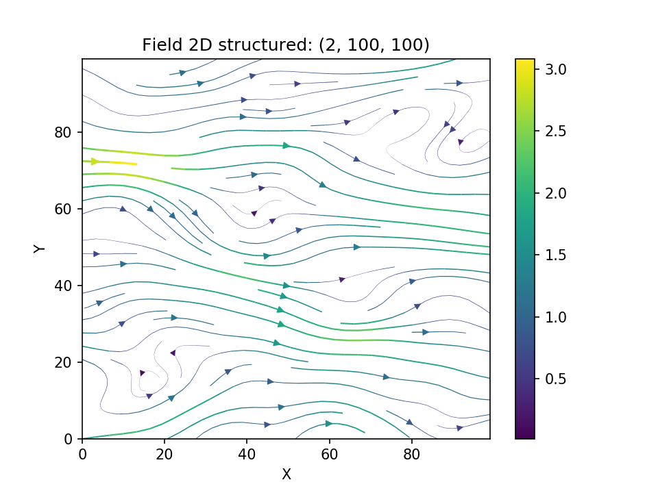
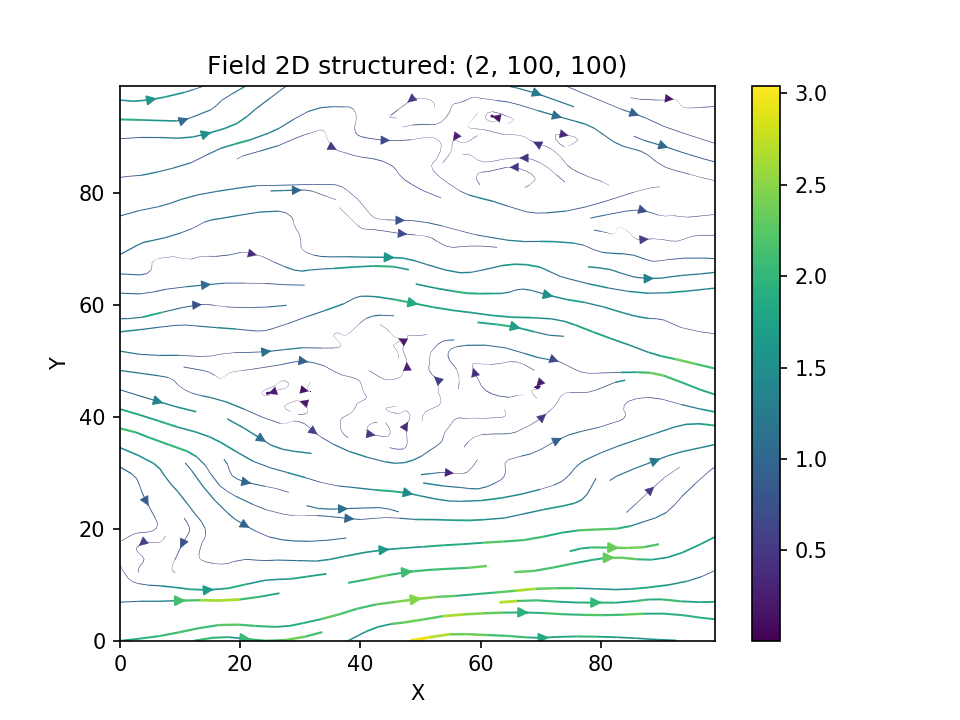

Tutorial 4: Random Vector Field Generation
==========================================

In 1970, Kraichnan was the first to suggest a randomization method.
For studying the diffusion of single particles in a random incompressible
velocity field, he came up with a randomization method which includes a
projector which ensures the incompressibility of the vector field.

Theoretical Background
----------------------

Without loss of generality we assume that the mean velocity :math:`\bar{U}` is oriented
towards the direction of the first basis vector :math:`\mathbf{e}_1`. Our goal is now to
generate random fluctuations with a given covariance model around this mean velocity.
And at the same time, making sure that the velocity field remains incompressible or
in other words, ensure :math:`\nabla \cdot \mathbf U = 0`.
This can be done by using the randomization method we already know, but adding a
projector to every mode being summed:

.. math::

   \mathbf{U}(\mathbf{x}) = \bar{U} \mathbf{e}_1 - \sqrt{\frac{\sigma^{2}}{N}}
   \sum_{i=1}^{N} \mathbf{p}(\mathbf{k}_i) \left[ Z_{1,i}
      \cos\left( \langle \mathbf{k}_{i}, \mathbf{x} \rangle \right)
   + \sin\left( \langle \mathbf{k}_{i}, \mathbf{x} \rangle \right) \right]

with the projector

.. math::

   \mathbf{p}(\mathbf{k}_i) = \mathbf{e}_1 - \frac{\mathbf{k}_i k_1}{k^2} \; .

By calculating :math:`\nabla \cdot \mathbf U = 0`, it can be verified, that
the resulting field is indeed incompressible.

Generating a Random Vector Field
--------------------------------

As a first example we are going to generate a vector field with a Gaussian
covariance model on a structured grid:

.. code-block:: python

   import numpy as np
   import matplotlib.pyplot as plt
   from gstools import SRF, Gaussian
   x = np.arange(100)
   y = np.arange(100)
   model = Gaussian(dim=2, var=1, len_scale=10)
   srf = SRF(model, generator='VectorField')
   srf((x, y), mesh_type='structured', seed=19841203)
   srf.plot()

And we get a beautiful streamflow plot:

Let us have a look at the influence of the covariance model. Choosing the
exponential model and keeping all other parameters the same

.. code-block:: python

   from gstools import Exponential
   
   model2 = Exponential(dim=2, var=1, len_scale=10)
   srf.model = model2
   srf((x, y), mesh_type='structured', seed=19841203)
   srf.plot()

we get following result

and we see, that the wiggles are much "rougher" than the smooth Gaussian ones.

Applications
------------

One great advantage of the Kraichnan method is, that after some initializations,
one can compute the velocity field at arbitrary points, online, with hardly any
overhead.
This means, that for a Lagrangian transport simulation for example, the velocity
can be evaluated at each particle position very efficiently and without any
interpolation. These field interpolations are a common problem for Lagrangian
methods.

.. raw:: latex

    \clearpage
