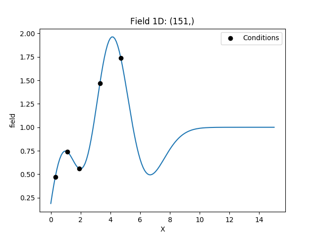
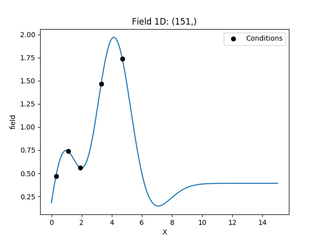

Tutorial 5: Kriging
===================

The subpackage :py:mod:`gstools.krige` provides routines for Gaussian process regression, also known as kriging.
Kriging is a method of data interpolation based on predefined covariance models.

We provide two kinds of kriging routines:

* Simple: The data is interpolated with a given mean value for the kriging field.
* Ordinary: The mean of the resulting field is unkown and estimated during interpolation.

Theoretical Background
----------------------

Aim of kriging is to derive the value of a field at some point :math:`x_0`,
when there are fix observed values :math:`z(x_1)\ldots z(x_n)` at given points :math:`x_i`.

The resluting value :math:`z_0` at :math:`x_0` is calculated as a weighted mean:

.. math::

   z_0 = \sum_{i=1}^n w_i(x_0) \cdot z_i

The weights :math:`W = (w_1,\ldots,w_n)` depent on the given covariance model and the location of the target point.

The different kriging approaches provide different ways of calculating :math:`W`.

Implementation
--------------

The routines for kriging are almost identical to the routines for spatial random fields.
First you define a covariance model, as described in the SRF Tutorial,
then you initialize the kriging class with this model:

.. code-block:: python

    from gstools import Gaussian, krige
    # condtions
    cond_pos = ...
    cond_val = ...
    model = Gaussian(dim=1, var=0.5, len_scale=2)
    krig = krige.Simple(model, mean=1, cond_pos=[cond_pos], cond_val=cond_val)

The resulting field instance ``krig`` has the same methods as the :any:`SRF` class.
You can call it to evaluate the kriging field at different points,
you can plot the latest field or you can export the field and so on.
Have a look at the documentation of :any:`Simple` and :any:`Ordinary`.

Simple Kriging
--------------

Simple kriging assumes a known mean of the data.
For simplicity we assume a mean of 0,
which can be achieved by subtracting the mean from the observed values and
subsequently adding it to the resulting data.

The resulting equation system for :math:`W` is given by:

.. math::

   W = \begin{pmatrix}c(x_1,x_1) & \cdots & c(x_1,x_n) \\
   \vdots & \ddots & \vdots  \\
   c(x_n,x_1) & \cdots & c(x_n,x_n)
   \end{pmatrix}^{-1}
   \begin{pmatrix}c(x_1,x_0) \\ \vdots \\ c(x_n,x_0) \end{pmatrix}

Thereby :math:`c(x_i,x_j)` is the covariance of the given observations.

Example
^^^^^^^

Here we use simple kriging in 1D (for plotting reasons) with 5 given observations/condtions.
The mean of the field has to be given beforehand.

.. code-block:: python

    import numpy as np
    from gstools import Gaussian, krige
    # condtions
    cond_pos = [0.3, 1.9, 1.1, 3.3, 4.7]
    cond_val = [0.47, 0.56, 0.74, 1.47, 1.74]
    # resulting grid
    gridx = np.linspace(0.0, 15.0, 151)
    # spatial random field class
    model = Gaussian(dim=1, var=0.5, len_scale=2)
    krig = krige.Simple(model, mean=1, cond_pos=[cond_pos], cond_val=cond_val)
    krig([gridx])
    ax = krig.plot()
    ax.scatter(cond_pos, cond_val, color="k", zorder=10, label="Conditions")
    ax.legend()

Ordinary Kriging
----------------

Ordinary kriging will estimate an appropriate mean of the field,
based on the given observations/conditions and the covariance model in use.

The resulting equation system for :math:`W` is given by:

.. math::

   \begin{pmatrix}W\\\mu\end{pmatrix} = \begin{pmatrix}
   \gamma(x_1,x_1) & \cdots & \gamma(x_1,x_n) &1 \\
   \vdots & \ddots & \vdots  & \vdots \\
   \gamma(x_n,x_1) & \cdots & \gamma(x_n,x_n) & 1 \\
   1 &\cdots& 1 & 0
   \end{pmatrix}^{-1}
   \begin{pmatrix}\gamma(x_1,x_0) \\ \vdots \\ \gamma(x_n,x_0) \\ 1\end{pmatrix}

Thereby :math:`\gamma(x_i,x_j)` is the semi-variogram of the given observations
and :math:`\mu` is a Lagrange multiplier to minimize the kriging error and estimate the mean.

Example
^^^^^^^

Here we use ordinary kriging in 1D (for plotting reasons) with 5 given observations/condtions.
The estimated mean can be accessed by ``krig.mean``.

.. code-block:: python

    import numpy as np
    from gstools import Gaussian, krige
    # condtions
    cond_pos = [0.3, 1.9, 1.1, 3.3, 4.7]
    cond_val = [0.47, 0.56, 0.74, 1.47, 1.74]
    # resulting grid
    gridx = np.linspace(0.0, 15.0, 151)
    # spatial random field class
    model = Gaussian(dim=1, var=0.5, len_scale=2)
    krig = krige.Ordinary(model, cond_pos=[cond_pos], cond_val=cond_val)
    krig([gridx])
    ax = krig.plot()
    ax.scatter(cond_pos, cond_val, color="k", zorder=10, label="Conditions")
    ax.legend()

.. raw:: latex

    \clearpage
