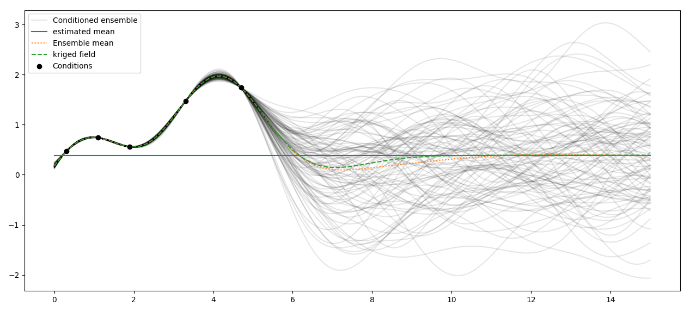

Tutorial 6: Conditioned Fields
==============================

Kriged fields tend to approach the field mean outside the area of observations.
To generate random fields, that coincide with given observations, but are still
random according to a given covariance model away from the observations proximity,
we provide the generation of conditioned random fields.

Theoretical Background
----------------------

The idea behind conditioned random fields builds up on kriging.
First we generate a field with a kriging method, then we generate a random field,
and finally we generate another kriged field to eliminate the error between
the random field and the kriged field of the given observations.

To do so, you can choose between ordinary and simple kriging.
In case of ordinary kriging, the mean of the SRF will be overwritten by the
estimated mean.

The setup of the spatial random field is the same as described in
:doc:`the SRF tutorial</tutorial_02_cov>`.
You just need to add the conditions as described in :doc:`the kriging tutorial</tutorial_05_kriging>`:

.. code-block:: python

    srf.set_condition(cond_pos, cond_val, "simple")

or:

.. code-block:: python

    srf.set_condition(cond_pos, cond_val, "ordinary")

Example: Conditioning with Ordinary Kriging
-------------------------------------------

Here we use ordinary kriging in 1D (for plotting reasons) with 5 given observations/conditions,
to generate an ensemble of conditioned random fields.
The estimated mean can be accessed by ``srf.mean``.

.. code-block:: python

    import numpy as np
    from gstools import Gaussian, SRF
    import matplotlib.pyplot as plt
    # conditions
    cond_pos = [0.3, 1.9, 1.1, 3.3, 4.7]
    cond_val = [0.47, 0.56, 0.74, 1.47, 1.74]
    gridx = np.linspace(0.0, 15.0, 151)
    # spatial random field class
    model = Gaussian(dim=1, var=0.5, len_scale=2)
    srf = SRF(model)
    srf.set_condition(cond_pos, cond_val, "ordinary")
    fields = []
    for i in range(100):
        if i % 10 == 0: print(i)
        fields.append(srf(gridx, seed=i))
        label = "Conditioned ensemble" if i == 0 else None
        plt.plot(gridx, fields[i], color="k", alpha=0.1, label=label)
    plt.plot(gridx, np.full_like(gridx, srf.mean), label="estimated mean")
    plt.plot(gridx, np.mean(fields, axis=0), linestyle=':', label="Ensemble mean")
    plt.plot(gridx, srf.krige_field, linestyle='dashed', label="kriged field")
    plt.scatter(cond_pos, cond_val, color="k", zorder=10, label="Conditions")
    plt.legend()
    plt.show()

As you can see, the kriging field coincides with the ensemble mean of the
conditioned random fields and the estimated mean is the mean of the far-field.

.. raw:: latex

    \clearpage
