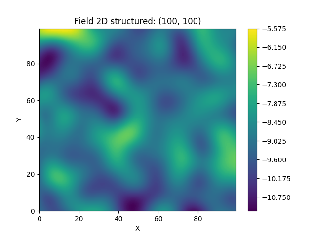
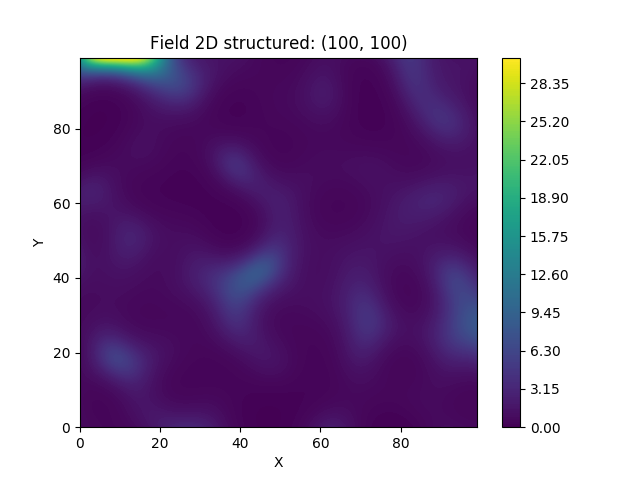
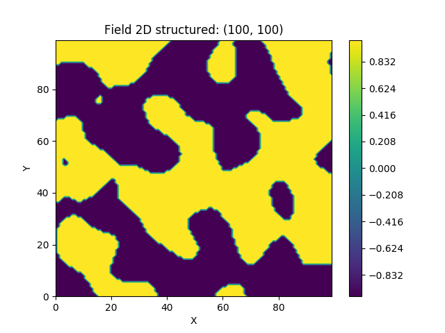
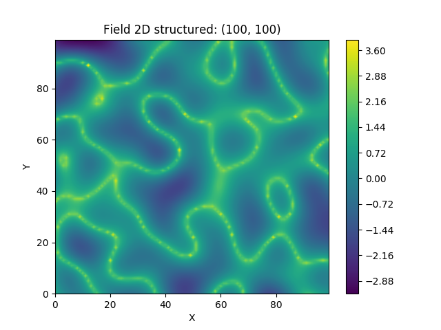
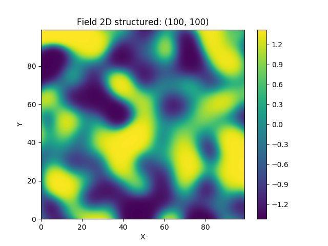
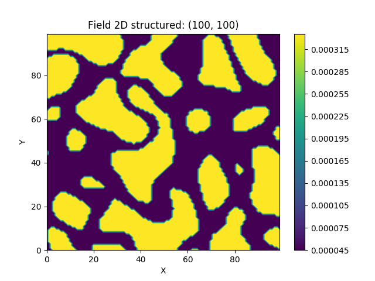

Tutorial 7: Field transformations
=================================

The generated fields of gstools are ordinary Gaussian random fields.
In application there are several transformations to describe real world
problems in an appropriate manner.

GStools provides a submodule :py:mod:`gstools.transform` with a range of
common transformations:

.. currentmodule:: gstools.transform

.. autosummary::
   binary
   boxcox
   zinnharvey
   normal_force_moments
   normal_to_lognormal
   normal_to_uniform
   normal_to_arcsin
   normal_to_uquad

Implementation
--------------

All the transformations take a field class, that holds a generated field,
as input and will manipulate this field inplace.

Simply import the transform submodule and apply a transformation to the srf class:

.. code-block:: python

    from gstools import transform as tf
    ...
    tf.normal_to_lognormal(srf)

In the following we will start from a simple random field following a Gaussian covariance:

1. Example: log-normal fields
-----------------------------

Here we transform a field to a log-normal distribution:

.. code-block:: python

    from gstools import SRF, Gaussian
    from gstools import transform as tf
    # structured field with a size of 100x100 and a grid-size of 1x1
    x = y = range(100)
    model = Gaussian(dim=2, var=1, len_scale=10)
    srf = SRF(model, seed=20170519)
    srf.structured([x, y])
    tf.normal_to_lognormal(srf)
    srf.plot()

2. Example: binary fields
-------------------------

Here we transform a field to a binary field with only two values.
The dividing value is the mean by default and the upper and lower values
are derived to preserve the variance.

.. code-block:: python

    from gstools import SRF, Gaussian
    from gstools import transform as tf
    # structured field with a size of 100x100 and a grid-size of 1x1
    x = y = range(100)
    model = Gaussian(dim=2, var=1, len_scale=10)
    srf = SRF(model, seed=20170519)
    srf.structured([x, y])
    tf.binary(srf)
    srf.plot()

3. Example: Zinn & Harvey transformation
----------------------------------------

Here, we transform a field with the so called "Zinn & Harvey" transformation presented in
`Zinn & Harvey (2003) <https://www.researchgate.net/publication/282442995_zinnharvey2003>`__.
With this transformation, one could overcome the restriction that in ordinary
Gaussian random fields the mean values are the ones being the most connected.

.. code-block:: python

    from gstools import SRF, Gaussian
    from gstools import transform as tf
    # structured field with a size of 100x100 and a grid-size of 1x1
    x = y = range(100)
    model = Gaussian(dim=2, var=1, len_scale=10)
    srf = SRF(model, seed=20170519)
    srf.structured([x, y])
    tf.zinnharvey(srf, conn="high")
    srf.plot()

4. Example: bimodal fields
--------------------------

We provide two transformations to obtain bimodal distributions:

* `arcsin <https://en.wikipedia.org/wiki/Arcsine_distribution>`__.
* `uquad <https://en.wikipedia.org/wiki/U-quadratic_distribution>`__.

Both transformations will preserve the mean and variance of the given field by default.

.. code-block:: python

    from gstools import SRF, Gaussian
    from gstools import transform as tf
    # structured field with a size of 100x100 and a grid-size of 1x1
    x = y = range(100)
    model = Gaussian(dim=2, var=1, len_scale=10)
    srf = SRF(model, seed=20170519)
    field = srf.structured([x, y])
    tf.normal_to_arcsin(srf)
    srf.plot()

5. Example: Combinations
------------------------

You can combine different transformations simply by successively applying them.

Here, we first force the single field realization to hold the given moments,
namely mean and variance.
Then we apply the Zinn & Harvey transformation to connect the low values.
Afterwards the field is transformed to a binary field and last but not least,
we transform it to log-values.

.. code-block:: python

    from gstools import SRF, Gaussian
    from gstools import transform as tf
    # structured field with a size of 100x100 and a grid-size of 1x1
    x = y = range(100)
    model = Gaussian(dim=2, var=1, len_scale=10)
    srf = SRF(model, mean=-9, seed=20170519)
    srf.structured([x, y])
    tf.normal_force_moments(srf)
    tf.zinnharvey(srf, conn="low")
    tf.binary(srf)
    tf.normal_to_lognormal(srf)
    srf.plot()

The resulting field could be interpreted as a transmissivity field, where
the values of low permeability are the ones being the most connected
and only two kinds of soil exist.

.. raw:: latex

    \clearpage
